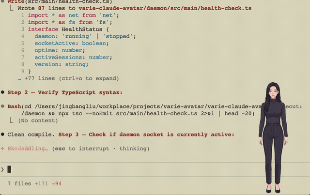
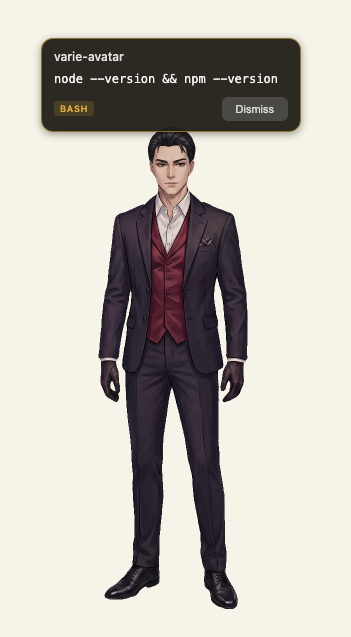
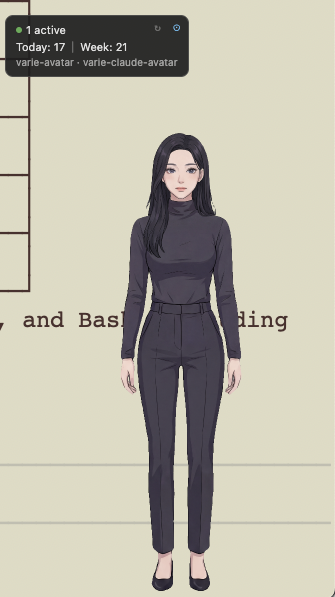
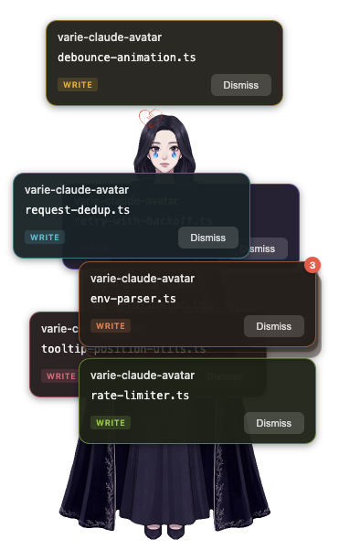

# Varie Claude Avatar



An animated character companion for [Claude Code](https://claude.ai/code) that lives as a desktop overlay, reacting to your coding sessions with expressions and notifications.

<p>
  
  
  
</p>

*Approval notifications · Session stats · ...or when you push Claude Code a little too hard across sessions*

Pick from a library of characters — or [create your own](https://varie.ai) — and launch it alongside Claude Code. The avatar shows expressions as tools run, keeps you on top of notifications across multiple sessions, and tracks your usage stats at a glance.

## Table of Contents

- [Installation](#installation)
- [Features](#features)
- [Notifications](#notifications)
- [Characters](#characters)
- [Stats Panel](#stats-panel)
- [Platform Support](#platform-support)
- [Development](#development)
- [Architecture](#architecture)
- [License](#license)

## Installation

### Install the Plugin

```bash
# 1. Add marketplace
/plugin marketplace add https://github.com/varie-ai/varie-claude-avatar

# 2. Install plugin
/plugin install varie-avatar@varie-avatar

# 3. Restart Claude Code — the avatar appears automatically
```

**That's it!** The desktop app downloads automatically in the background on your first session and launches from the next session onward.

### Alternative Install Methods

**Interactive install** (if auto-download didn't run):

```
/varie-avatar:install
```

**Manual download:**

Download the latest `.dmg` from [Releases](https://github.com/varie-ai/varie-claude-avatar/releases), open it, and drag to Applications.

### Updating

1. Run `/plugin`, select your marketplace, then **Update marketplace**
2. Select **Installed**, choose `varie-avatar`, then **Update now**
3. Restart Claude Code for hook changes to take effect

The desktop app will be updated separately from [Releases](https://github.com/varie-ai/varie-claude-avatar/releases) (auto-update coming soon).

### Gatekeeper Note (macOS)

If you encounter a "developer cannot be verified" prompt on first launch:
- **macOS 14 and earlier:** Right-click the app → Open → click Open
- **macOS 15 (Sequoia):** System Settings → Privacy & Security → scroll down → click "Open Anyway"

This typically only affects manual `.dmg` installs — the automatic install via `curl` bypasses Gatekeeper.

## Features

### 🎭 Animated Character Overlay
- Spine-animated character sits on your desktop as a transparent overlay
- Reacts to Claude Code events with expressions and animations
- Tracks your cursor for eye-gaze follow
- Drag to reposition, resize (S/M/L), or minimize

### 🔔 Cross-Session Notifications
- See approval requests, questions, and attention alerts across all your Claude Code sessions
- Notification badges with project name, tool info, and command summaries
- Click to dismiss — keeps your workspace uncluttered

### 🎨 Character Library
- Browse and switch characters from the [Varie](https://varie.ai) character library
- Create your own characters at [varie.ai/varie-mate](https://varie.ai/varie-mate)
- Characters are cached locally after first download

### 📊 Usage Stats
- Session count, daily/weekly totals, top projects
- Hover top-left corner to reveal, pin to keep visible
- Data stored locally with 7-day rolling window

### 🔒 Privacy
- **No telemetry, no analytics, no tracking**
- No external network connections except downloading character data from Varie
- All session stats, notifications, and state stay local on your machine
- Communication between plugin and daemon via local Unix socket

## Notifications

| Event | Response |
|-------|----------|
| Tool needs approval | Notification badge with tool name + command summary |
| Tool completes | Success expression |
| Claude asks a question | Question notification + expression |
| Plan ready for review | Notification badge |
| Claude needs attention | Pulsing attention notification |

## Characters

Browse and switch characters using plugin skills:

```
/varie-avatar:list          # Browse available characters
/varie-avatar:set <id>      # Switch to a character
/varie-avatar:status        # Check current character and daemon status
```

Characters are loaded from the [Varie](https://varie.ai) character library. Create your own at [varie.ai/varie-mate](https://varie.ai/varie-mate).

## Stats Panel

Hover over the top-left corner of the overlay to reveal:
- Active session count (green dot)
- Today's and this week's session totals
- Your most-used projects

Click the pin button to keep the panel visible. Click reload to reset the active session count.

## Platform Support

| Platform | Status | Install Path |
|----------|--------|-------------|
| macOS (Apple Silicon) | Supported | `~/Applications/` or `/Applications/` |
| macOS (Intel) | Supported | `~/Applications/` or `/Applications/` |
| Windows | Planned | `%LOCALAPPDATA%/Programs/` |
| Linux | Planned | `~/.local/bin/` |

**Requirements:**
- macOS 10.15+ (Catalina or later)
- Claude Code with plugin support
- Node.js 18+ (for building from source only)

## Development

### Running the Daemon in Dev Mode

```bash
cd daemon
npm install
npm run dev     # Build + launch Electron
npm run watch   # Watch mode (rebuild on file change)
```

### Testing Notifications

```bash
# Send a test attention notification
echo '{"type":"attention","tool":"","sessionId":"test","timestamp":'$(date +%s)000',"metadata":{"project":"test","projectPath":"/test","summary":"Testing"}}' \
  | nc -w1 -U /tmp/varie-claude-avatar.sock

# Send a test approval notification
echo '{"type":"approval_needed","tool":"Bash","sessionId":"test","timestamp":'$(date +%s)000',"metadata":{"project":"test","projectPath":"/test","summary":"npm install"}}' \
  | nc -w1 -U /tmp/varie-claude-avatar.sock
```

### Packaging

```bash
npm run package:mac   # macOS .app + .dmg + .zip
npm run package:win   # Windows .exe (NSIS + portable)
```

### Deploy Locally

```bash
# Build, package, kill old process, install to /Applications, and launch
scripts/deploy-local.sh

# Skip build (just kill + replace + launch)
scripts/deploy-local.sh --skip-build
```

## Architecture

```
plugin/                          daemon/
┌─────────────────────┐          ┌──────────────────────────────┐
│  SessionStart hook   │──────▶  │  ensure-daemon-running       │
│  PreToolUse hook     │──┐      │  (auto-launch / auto-install)│
│  PostToolUse hook    │  │      └──────────────────────────────┘
│  Stop hook           │  │                    │
│  Notification hook   │  │      ┌─────────────▼────────────────┐
└─────────────────────┘  │      │  Socket Server                │
                         │      │  /tmp/varie-claude-avatar.sock│
  varie-avatar-notify    │      └─────────────┬────────────────┘
  (sends JSON events) ◀──┘                    │
         │                       ┌─────────────▼────────────────┐
         └──────────────────────▶│  Electron Main Process       │
                                 │  ├── SessionTracker          │
                                 │  ├── StatsTracker            │
                                 │  └── MouseTracker            │
                                 └─────────────┬────────────────┘
                                               │
                                 ┌─────────────▼────────────────┐
                                 │  Renderer                    │
                                 │  ├── Spine Character (WebGL) │
                                 │  ├── Notification Manager    │
                                 │  └── Stats Panel             │
                                 └──────────────────────────────┘
```

### Project Structure

```
varie-claude-avatar/
├── daemon/                 # Electron desktop overlay app
│   ├── src/main/           # Main process (window, socket, tracking)
│   ├── src/renderer/       # Renderer (Spine character, notifications, UI)
│   ├── assets/             # App icons
│   └── package.json
├── plugin/                 # Claude Code plugin
│   ├── .claude-plugin/     # Plugin manifest
│   ├── hooks/              # Event hooks (hooks.json)
│   ├── scripts/            # ensure-daemon-running, install-daemon, varie-avatar-notify
│   └── skills/             # /varie-avatar:list, :set, :status, :install
└── scripts/                # Build and deploy helpers
```

## License

MIT — see [LICENSE](LICENSE) for details.
